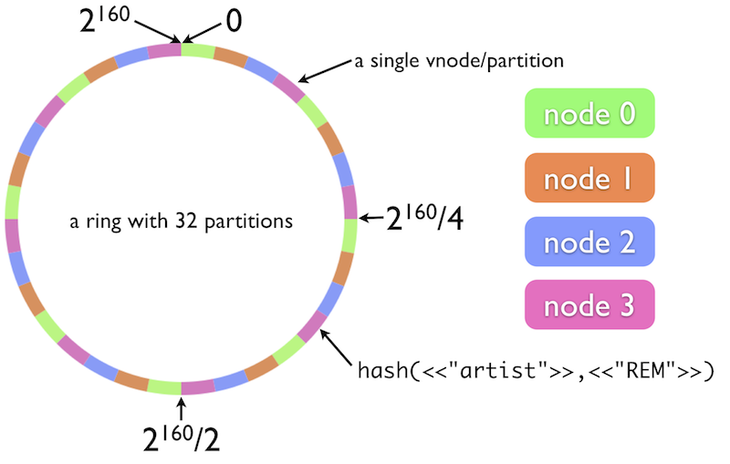

!SLIDE bullets incremental

# What's Riak? #

* Key-Value Store
* Distributed
* Scalable
* Really, really scalable

!SLIDE

## Inspired by [Amazon's Dynamo](http://www.allthingsdistributed.com/2007/10/amazons_dynamo.html) ##

!SLIDE bullets incremental

# Dynamo in a Nutshell #

* Data is partitioned into slices
* A server can serve multiple slices (vnodes)

!SLIDE center

!SLIDE bullets incremental

# Consistent Hashing #

* Determines partition from key

!SLIDE bullets incremental

# Dynamo/Riak Cluster #

* All nodes are equal
* Nodes can join and leave anytime
* Cluster rebalances partitions
* Easy scale-up and -down

!SLIDE bullets incremental

# Replication #

* Data is replicated across N nodes
* Data must be read from R nodes
* Data must be written to W nodes

!SLIDE center

