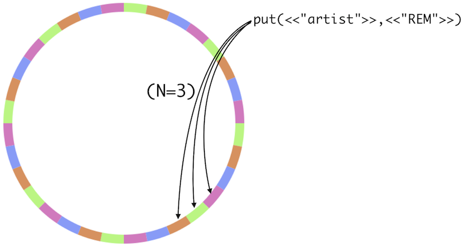

!SLIDE bullets incremental

# What's Riak? #

* Key-Value Store
* Distributed
* Scalable
* Really, really scalable

!SLIDE

## Inspired by [Amazon's Dynamo](http://www.allthingsdistributed.com/2007/10/amazons_dynamo.html) ##

!SLIDE bullets incremental

# Basics #

* Data is partitioned into slices
* A server can serve multiple slices (vnodes)

!SLIDE center

!SLIDE bullets incremental

# Consistent Hashing #

* Determines partition from key

!SLIDE bullets incremental

# Dynamo/Riak Cluster #

* All nodes are equal
* Nodes can join and leave anytime
* Cluster rebalances partitions
* Easy scale-up and -down

!SLIDE bullets incremental

# Replication #

* Data is replicated across N nodes
* Data must be read from R nodes
* Data must be written to W nodes

!SLIDE center

!SLIDE bullets incremental

# Riak Basics #

* Buckets, keys, values
* Buckets are like flat namespaces
* Sane HTTP interface
* Protobufs if you want to

!SLIDE bullets incremental

# Object Versioning #

* Vector clocks track object changes
* New vector clock for every change
* Automatic or manual conflict resolution

!SLIDE center

## Vector Clocks are [easy](http://blog.basho.com/2010/01/29/why-vector-clocks-are-easy/) and [hard](http://blog.basho.com/2010/04/05/why-vector-clocks-are-hard/). ##

!SLIDE bullets incremental

# Querying Data #

* By key
* Map/Reduce
* Link walking

!SLIDE bullets incremental

# Links #

* Riak objects can have links to other objects
* Links can be tagged

!SLIDE

# A conversation with Riak #

!SLIDE commandline incremental small

# Get Bucket Properties #

    $ curl -D - http://localhost:8098/riak/rubies
    HTTP/1.1 200 OK
    Vary: Accept-Encoding
    Server: MochiWeb/1.1 WebMachine/1.7.1 (participate in the frantic)
    Date: Thu, 02 Sep 2010 11:06:47 GMT
    Content-Type: application/json
    Content-Length: 370
    {"props":{"name":"rubies","n_val":3,"allow_mult":false,
    last_write_wins":false,"precommit":[],"postcommit":[],
    chash_keyfun":{"mod":"riak_core_util",
    "fun":"chash_std_keyfun"},"linkfun":
    ...

!SLIDE smaller

# Set Bucket Properties #

    $ curl -D - PUT -H "Content-Type: application/json" \
      -d '{"props":{"n_val":5}}' \
      http://localhost:8098/riak/rubies

!SLIDE smaller commandline incremental

# Fetch an Object #

    $ curl -D - http://localhost:8098/riak/rubies/rbx
    HTTP/1.1 404 Object Not Found
    Server: MochiWeb/1.1 WebMachine/1.7.1 (participate in the frantic)
    Date: Thu, 02 Sep 2010 12:42:23 GMT
    Content-Type: text/plain
    Content-Length: 10

    not found

!SLIDE center

# Whoops! #

!SLIDE smaller

# Create an Object #

    $ curl -D - -X PUT -H "Content-Type: application/json" \
    -d '{"version": "1.0"}' localhost:8098/riak/rubies/rbx

!SLIDE smaller

# Fetch an Object (again) #

    $ curl -D - localhost:8098/riak/rubies/rbx
    HTTP/1.1 200 OK
    X-Riak-Vclock: a85hYGBgzGDKBVIszLIxwhlMiYx5rAzTJL4c5csCAA==
    Vary: Accept-Encoding
    Server: MochiWeb/1.1 WebMachine/1.7.1 (participate in the frantic)
    Link: </riak/rubies>; rel="up"
    Last-Modified: Thu, 02 Sep 2010 12:46:14 GMT
    ETag: 70SLW1IjL0YvRvW8pDECMN
    Date: Thu, 02 Sep 2010 12:49:32 GMT
    Content-Type: application/json
    Content-Length: 18

    {"version": "1.0"}

!SLIDE smaller

# Create some more #

    $ curl -D - -X PUT -H "Content-Type: application/json" \
    -d '{"version": "0.6"}' localhost:8098/riak/rubies/macruby

    $ curl -D - -X PUT -H "Content-Type: application/json" \
    -d '{"version": "1.9.2"}' localhost:8098/riak/rubies/mri

!SLIDE smaller

# Links #

    $ curl -D - -X POST -H "Content-Type: application/json" \
    -H 'Link: </riak/rubies/macruby>; riaktag="llvm"' \
    -d '{"version": "1.0.0"}' \
    localhost:8098/riak/rubies/rbx

!SLIDE smaller commandline incremental

# Links #

    $ curl -D - http://localhost:8098/riak/rubies/rbx        
    HTTP/1.1 200 OK
    X-Riak-Vclock: a85hYGBgzmDKBVIszLIxwhlMiYx5rAzTJL4c5YMKM3oGrIMKH5CGC7M1JzGd1C9DlsgCAA==
    Vary: Accept-Encoding
    Server: MochiWeb/1.1 WebMachine/1.7.1 (participate in the frantic)
    Link: </riak/rubies/macruby>; riaktag="llvm", </riak/rubies>; rel="up"
    Last-Modified: Thu, 02 Sep 2010 12:59:44 GMT
    ETag: 5R0AS2o0y81CIB4LpcHD5y
    Date: Thu, 02 Sep 2010 12:59:50 GMT
    Content-Type: application/json
    Content-Length: 20

    {"version": "1.0.0"}

